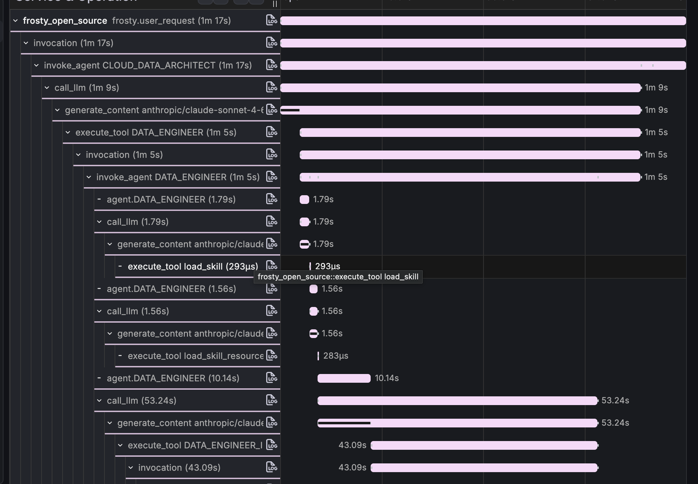

# Frosty AI

**Frosty** is an open-source agentic framework for Snowflake — built by [Gyrus Inc](https://www.thegyrus.com) and free for anyone to run, extend, and own. 
  
Type *"who are my top 10 customers by revenue last quarter?"* and get a Markdown table back. Type *"set up MFA for all users without it"* and watch the ALTER statements run. Type *"why is my warehouse spend up 40% this month?"* and get an ACCOUNT_USAGE breakdown. Frosty is a 153-agent system that turns plain English into Snowflake operations — and unlike the managed alternatives, you host it, you own it, and you pay nothing beyond your LLM tokens.

## Why Frosty?

### No vendor lock-in — you own the stack

Frosty is self-hosted. The agents run in your environment, credentials never leave your machine, and you can read or modify every line of logic. There is no SaaS platform between you and your data warehouse.

### Bring your own model

Frosty works with OpenAI, Anthropic Claude, and Google Gemini out of the box, and supports any model that Google ADK supports. Swap models in a single `.env` line — no code changes, no migration, no contract renegotiation. If a better model ships tomorrow, you can use it tomorrow.

### Purpose-built for Snowflake operations

153 specialist agents cover the full surface area of Snowflake: data engineering, administration, security, governance, cost monitoring, and read-only inspection. Each agent carries curated reference docs (SKILL.md) so it generates accurate DDL without hallucinating unsupported syntax.

### Safe by design

`DROP` statements are blocked unconditionally — at both the prompt level and in code. `CREATE OR REPLACE` is allowed but requires explicit terminal approval before any query reaches Snowflake: when an agent generates one, execution pauses, the full statement is shown, and you type `yes` or `no` to proceed or abort. Operations execute one at a time, in dependency order, with the manager validating each step before proceeding.

### Natural language all the way down

Query your data, profile tables, generate synthetic rows, build Streamlit dashboards, inspect infrastructure costs — all from plain English. No SQL required for day-to-day operations.

### Understands your entire Snowflake environment before it acts

Before executing anything, the CLOUD_DATA_ARCHITECT routes through the INSPECTOR_PILLAR — 56 read-only specialists that map your live databases, schemas, tables, roles, warehouses, pipelines, and policies. Every plan is grounded in what actually exists in your account, not what the model assumes. The result is a fully context-aware system — Frosty understands the complete state of your environment before taking any action, every inference is visible and inspectable, and nothing is hidden behind a managed layer or limited to what a platform chooses to expose.

### Build your own analyst service

The DATA_ANALYST specialist is a fully self-contained natural-language-to-SQL engine: it discovers schema, generates Snowflake SQL, enforces a read-only safety gate, and returns plain-English answers with Markdown tables. Wrap it in any UI — a web app, a Slack bot, an internal dashboard — and give your analysts a conversational query experience you fully own and control. You pay only for LLM token usage. No feature add-ons, no per-seat fees, no platform markup.

Frosty supports **OpenAI**, **Claude**, and **Gemini** models out of the box. Any other model that Google ADK supports can also be used — refer to the [Google ADK Models documentation](https://google.github.io/adk-docs/agents/models/) for the full list.

---

## Quick Start

```bash
git clone https://github.com/MalviyaPriyank/frosty.git
cd frosty
python -m venv .venv && source .venv/bin/activate
pip install -r requirements.txt
```

Copy `.env.example` to `.env` and fill in your Snowflake credentials and model API key (see [Configure](#configure)), then:

```bash
python -m src.frosty_ai.objagents.main
```

> Full setup details — MFA, model providers, observability — are in [Setup](#setup) below.

---

## Safety — Two Layers of Protection

Frosty enforces two independent safeguards before any query reaches Snowflake:

**Layer 1 — Agent instructions (prompt-level)**
Every agent prefers `CREATE IF NOT EXISTS` or `ALTER` over `CREATE OR REPLACE`. `DROP` is forbidden outright. Agents may generate `CREATE OR REPLACE` when the user explicitly requests it or when `ALTER`/`CREATE IF NOT EXISTS` cannot achieve the result — in which case the tool gates it with a human approval prompt.

**Layer 2 — `execute_query` safety gate (code-level)**
A hard-coded check in `tools.py` intercepts every call to `execute_query` before it reaches Snowflake:

- **`DROP`** — blocked unconditionally. No prompt, no override.
- **`CREATE OR REPLACE`** — execution pauses. The full statement is displayed in a red panel on the terminal and the user is asked `Proceed? [yes/no]`. Only `yes` or `y` allows the query through; anything else returns a "user declined" response to the agent, which then suggests alternatives.

```
User request
     │
     ▼
Agent generates SQL
     │
     ▼ execute_query safety gate (tools.py)
     │   ├─ contains "DROP"?              → hard blocked, never reaches Snowflake
     │   ├─ contains "CREATE OR REPLACE"? → paused, user approval prompt shown
     │   │       ├─ user types "yes"      → passed through
     │   │       └─ user types "no"       → blocked, agent tries alternative
     │   └─ clean                         → passed through
     │
     ▼
execute_query() → Snowflake
```

Because Layer 2 is code — not a prompt — it cannot be bypassed by prompt injection or model drift. See [Key Safety Rules](#key-safety-rules) for details on extending the gate.

---

## Architecture

```
┌─────────────────────────────────────────────────────────────────────────────────────────────┐
│                                CLI  (Rich + prompt_toolkit)                                 │
└──────────────────────────────────────────────┬──────────────────────────────────────────────┘
                                               │ user message
                                               ▼
┌─────────────────────────────────────────────────────────────────────────────────────────────┐
│                             CLOUD_DATA_ARCHITECT  (Manager)                                 │
│         Strategic planner — classifies intent, produces execution plan,                     │
│              delegates one task at a time, validates every step via state                   │
└──────┬───────────────┬───────────────┬───────────────┬───────────────┬───────────────┬──────┘
       │               │               │               │               │               │
       ▼               ▼               ▼               ▼               ▼               ▼
┌─────────────┐ ┌─────────────┐ ┌─────────────┐ ┌─────────────┐ ┌─────────────┐ ┌─────────────┐
│    DATA     │ │    ADMIN    │ │  SECURITY   │ │ GOVERNANCE  │ │  INSPECTOR  │ │   ACCOUNT   │
│  ENGINEER   │ │             │ │  ENGINEER   │ │             │ │   PILLAR    │ │   MONITOR   │
└──────┬──────┘ └──────┬──────┘ └──────┬──────┘ └──────┬──────┘ └──────┬──────┘ └──────┬──────┘
       │               │               │               │               │               │
       ▼               ▼               ▼               ▼               ▼               ▼
    34 spec         16 spec         14 spec          8 spec         56 spec         25 spec
    (below)         (below)         (below)         (below)         (below)         (below)
       └───────────────┴───────────────┴───────────────┴───────────────┴───────────────┘
                                               │
                                               ▼
                                        execute_query()  ──►  Snowflake
                                                                      │
                                                                      ▼
                                                          app:TASKS_PERFORMED
                                                  each completed task appended to state
```

### Agent Hierarchy

| Pillar | Role | Specialists |
|---|---|---|
| **CLOUD_DATA_ARCHITECT** | Manager — plans, routes, validates | — |
| **DATA_ENGINEER** | Physical data layer orchestrator | 34 |
| **ADMINISTRATOR** | Identity, compute, RBAC | 16 |
| **SECURITY_ENGINEER** | Network & auth security | 14 |
| **GOVERNANCE_SPECIALIST** | Tags, policies, data access | 8 |
| **INSPECTOR_PILLAR** | Read-only infrastructure inspection | 56 |
| **ACCOUNT_MONITOR** | ACCOUNT_USAGE cost, billing, audit & operational health | 25 |
| **RESEARCH_AGENT** | Web search & knowledge cache — shared fallback for all pillars | — |

---

## Spotlight Features

### Web Search & Research Agent

Specialist agents follow a two-step knowledge hierarchy before generating any DDL or query:

**Step 1 — SKILL.md reference (when `USE_SKILLS=true`, the default)**
Each specialist has a curated `SKILL.md` that documents every supported parameter, its default value, and when to use it. The agent reads this before writing any statement, so it produces accurate, non-bloated DDL without hallucinating unsupported syntax.

**Step 2 — RESEARCH_AGENT fallback**
If the specialist cannot resolve something from SKILL.md — or if `USE_SKILLS=false` and the agent is relying on model knowledge alone — it can delegate to the RESEARCH_AGENT to look up the answer from live web sources before generating the query.

```
  Specialist Agent
       │
       ├─► SKILL.md (USE_SKILLS=true)  ──►  Generate query
       │       parameter reference            from reference
       │
       └─► RESEARCH_AGENT (fallback or USE_SKILLS=false)
                         │
                         ├── Gemini models  ──► google_search (built-in grounding)
                         │                      Retrieval-augmented over live web
                         │
                         └── All other models ─► DuckDuckGo · top 5 results
                                                  (swap via research/tools.py)
```

Results are persisted to `app:RESEARCH_RESULTS` in session state so the same answer is not fetched twice within a session. See `USE_SKILLS` under [Debug & Feature Flags](#configure) to toggle skill injection.

---

### Natural Language Data Queries

Ask questions about your Snowflake data in plain English and get SQL-powered answers — no SQL knowledge required:

```
  "how many orders did we get last month?"
  "show me the top 10 customers by revenue"
  "what's the average order value by region?"
                    │
                    ▼
         DATA_ANALYST specialist
         ┌──────────────────────────────────────┐
         │  discover_schema(database, schema)   │
         │  (INFORMATION_SCHEMA join — one      │
         │   round-trip for all tables +        │
         │   columns)                           │
         │               │                      │
         │               ▼                      │
         │  LLM generates Snowflake SQL         │
         │  from schema context + question      │
         │               │                      │
         │               ▼                      │
         │  run_data_query(sql)                 │
         │  (read-only safety gate — rejects    │
         │   any non-SELECT statement before    │
         │   it reaches Snowflake)              │
         └──────────────────────────────────────┘
                    │
                    ▼
         Plain-English answer with key numbers,
         Markdown tables, and notable findings
```

The agent **never writes SQL itself** — it gives the LLM full schema context (table names, column names, types, row counts, comments) so it can generate accurate, fully-qualified Snowflake SQL. A **read-only safety gate** rejects any INSERT, UPDATE, DELETE, DROP, or DDL statement before execution.

Trigger with natural language: *"how many"*, *"show me"*, *"top N"*, *"average"*, *"total"*, *"which customers"*, *"compare"*, *"query my data"*, *"what's the revenue"*.

#### Business Rules — Make It Smarter

By default the agent infers SQL purely from schema metadata. You can make it significantly more accurate by adding **business rules** — metric definitions, canonical date columns, standard filters, and join keys specific to your data model.

Ask Frosty to generate a first draft automatically:

```
  "generate my business rules draft for MY_DB.SALES"
                    │
                    ▼
         generate_business_rules_draft(database, schema)
         ┌──────────────────────────────────────────────┐
         │  Inspect INFORMATION_SCHEMA                  │
         │  · Metric candidates  — numeric columns      │
         │    named *VALUE / *AMOUNT / *REVENUE / *COST │
         │  · Date candidates    — DATE/TIMESTAMP cols, │
         │    flagging the most likely primary per table │
         │  · Enum candidates    — *STATUS / *TYPE cols │
         │    that likely need standard filters         │
         │  · Join key candidates — _ID columns shared  │
         │    across multiple tables                    │
         └──────────────────┬───────────────────────────┘
                            │
                            ▼
         Writes draft to:
         skills/snowflake-data-analyst/references/business-rules.md
                            │
                            ▼
         "Draft saved — open the file and fill in
          your actual definitions."
```

Open `skills/snowflake-data-analyst/references/business-rules.md`, replace the inferred placeholders with your real definitions:

```markdown
## Metric Definitions
- **Revenue**: SUM(ORDER_VALUE) WHERE STATUS IN ('COMPLETED', 'SHIPPED')
- **Active customers**: COUNT(DISTINCT CUSTOMER_ID) WHERE LAST_ORDER_DATE >= DATEADD('day', -90, CURRENT_DATE())

## Canonical Date Columns
- ORDERS: use ORDER_DATE (not CREATED_AT or UPDATED_AT)

## Standard Filters
- ORDERS: always exclude test orders — WHERE IS_TEST = FALSE

## Common Table Joins
- ORDERS → CUSTOMERS: JOIN ON ORDERS.CUSTOMER_ID = CUSTOMERS.ID
```

Once saved, the agent reads these rules before every SQL generation. Ask *"what was last month's revenue?"* and it will use `SUM(ORDER_VALUE) WHERE STATUS IN ('COMPLETED', 'SHIPPED')` — not a raw column sum — because you defined it. Disable by setting `USE_SKILLS=false`.

---

### Data Profiling

Ask Frosty to profile any Snowflake table and get a comprehensive statistical report in seconds — no SQL required:

```
  "profile the ORDERS table in MY_DB.SALES"
                    │
                    ▼
         DATA_PROFILER specialist
         ┌──────────────────────────────────────┐
         │  Fetch column metadata               │
         │  (INFORMATION_SCHEMA.COLUMNS)        │
         │               │                      │
         │               ▼                      │
         │  Single-pass profile query           │
         │  · null count & null %               │
         │  · distinct count & cardinality      │
         │  · min / max                         │
         │  · avg, stddev, p25, p50, p75        │
         │    (numeric columns only)            │
         │               │                      │
         │               ▼                      │
         │  Top-value frequency distribution    │
         │  (low-cardinality columns only)      │
         └──────────────────────────────────────┘
                    │
                    ▼
         Markdown report with 4 sections:
         · Table Summary
         · Column Profiles
         · Value Distributions
         · Data Quality Flags
```

The profiler runs a **single SQL pass** across all columns — not one query per column — keeping credit usage minimal even on wide tables. For categorical columns (STATUS, REGION, TYPE, etc.) it automatically fetches value frequency distributions. Data quality issues are surfaced automatically:

| Flag | Condition |
|---|---|
| ⚠️ High null rate | `null_pct > 20%` |
| ⚠️ All-null column | `null_pct = 100%` |
| ⚠️ Constant column | `distinct_count = 1` |
| ℹ️ High-cardinality ID | `distinct ≈ total_rows` |

Trigger with natural language: *"profile"*, *"describe columns"*, *"check data quality"*, *"show null rates"*, *"analyze distribution"*, *"explore table"*.

---

### Stored Procedure Validation — Safe Two-Step Creation

Frosty never writes a stored procedure directly. Every new or updated procedure goes through a mandatory two-step flow that validates syntax and logic before anything is committed to Snowflake:

```
  "create a stored procedure SP_LOAD_CUSTOMERS in CDC_PROCESSED.BRONZE"
                    │
                    ▼
         Step 1 — create_and_validate_procedure (validation only)
         ┌──────────────────────────────────────────────────────┐
         │  Rewrites procedure name to a unique temp name       │
         │  e.g. SP_LOAD_CUSTOMERS_FROSTY_VAL_3A2B1C4D         │
         │                    │                                 │
         │                    ▼                                 │
         │  BEGIN                                               │
         │    CREATE PROCEDURE <temp_name> (...)                │
         │    CALL <temp_name>(sample_args)   ← dry-run test    │
         │  ROLLBACK  ← always, pass or fail                    │
         │                                                      │
         │  Nothing persists in Snowflake                       │
         └──────────────────────┬───────────────────────────────┘
                                │
                  ┌─────────────┴─────────────┐
                  ▼                           ▼
            syntax/logic error          validation passes
            fix SQL, retry Step 1       proceed to Step 2
                  │                            │
         (5 consecutive failures)              ▼
                  │                Step 2 — execute_query (real creation)
                  ▼                ┌─────────────────────────────────────┐
         RESEARCH_AGENT invoked    │  execute_query(validated_sql)        │
         ┌────────────────────┐    │  CREATE OR REPLACE → approval prompt │
         │ 1. check cache     │    │  CREATE IF NOT EXISTS → direct       │
         │    (get_research_  │    └─────────────────────────────────────┘
         │     results)       │                   │
         │ 2. if not cached → │                   ▼
         │    live web search │      Procedure created in Snowflake
         │    for Snowflake   │
         │    SQL docs        │
         └────────┬───────────┘
                  │ retry with fresh knowledge
                  ▼
            still failing after
            5 more attempts?
                  │
                  ▼
            ⚠ skip & report to user
```

**Why this matters:**

- **No broken procedures** — syntax errors and runtime failures are caught before the real procedure is touched. If the dry-run CALL fails, nothing is changed in Snowflake.
- **Safe for existing procedures** — the validation step uses a throwaway name so it never collides with or overwrites a live procedure, even when testing updates.
- **Always rolled back** — the validation transaction is always rolled back regardless of outcome. The only thing that ever reaches Snowflake permanently is the final `execute_query` call in Step 2.
- **Approval gate on replace** — if Step 2 uses `CREATE OR REPLACE`, the standard approval prompt fires before execution, giving you a final review of the validated SQL.
- **Self-healing for complex procedures** — if the agent fails validation 5 consecutive times on a complex procedure, it automatically invokes the RESEARCH_AGENT to look up the latest Snowflake SQL docs from the web (checking a session cache first to avoid duplicate fetches), then retries with that fresh knowledge. If it still cannot produce a valid procedure after the research-backed retries, it stops and reports the error clearly so you can review it manually.

---

### Synthetic Data Generation

Ask Frosty to populate any table with realistic sample data and it will inspect the table structure first before writing a single row:

```
  "populate ORDERS table with 10 rows"
                    │
                    ▼
         DESCRIBE TABLE <db.schema.table>
                    │
                    ▼
      ┌─────────────────────────────────┐
      │  Infer value strategy per col   │
      │  · column name  →  domain hint  │
      │  · data type    →  format rule  │
      │  · nullability  →  NULL ratio   │
      └──────────────┬──────────────────┘
                     │
                     ▼
      INSERT INTO <table> (col1, col2, …)
      VALUES (realistic row 1),
             (realistic row 2), …
```

Frosty never invents column names — `DESCRIBE TABLE` is the single source of truth. Values are contextually appropriate: an `EMAIL` column gets valid email addresses, a `STATUS` column gets domain-specific enum values, `VARIANT` columns get minimal valid JSON, and so on.

---

### Thinking & Reasoning (Gemini only)

When using Google Gemini models, every agent is equipped with a `BuiltInPlanner` backed by Gemini's native `ThinkingConfig`. Before generating a response the model silently reasons through the problem within a token budget — this reasoning is not shown to the user but improves decision quality, especially for complex DDL and multi-step plans.

Thinking budgets are tiered by agent responsibility:

| Agent level | Thinking budget |
|---|---|
| Manager (`CLOUD_DATA_ARCHITECT`) + pillar agents | 1 024 tokens |
| Specialist agents | 512 tokens |
| Streamlit pipeline sub-agents | 256 tokens |

For OpenAI and Anthropic providers the planner is disabled — those models handle reasoning internally.

To override the default thinking model set `MODEL_THINKING` in your `.env` (see Configure → Model Provider).

---

### Built-in Code Execution (Gemini only)

The Streamlit app generation pipeline uses ADK's `BuiltInCodeExecutor` to validate generated code before it is returned to the calling agent. The code generator writes the Streamlit application for deployment in Snowflake, executes it in a sandboxed environment, and only hands it back if execution succeeds — catching syntax errors and import issues before any deployment step.

```
  "build a dashboard for ORDERS and CUSTOMERS"
                    │
                    ▼
         STREAMLIT_CODE_GENERATOR
         ┌──────────────────────────────────┐
         │  Generate Streamlit application   │
         │  Python application              │
         │           │                      │
         │           ▼                      │
         │  BuiltInCodeExecutor             │
         │  (sandboxed execution)           │
         │           │                      │
         │  ✓ passes → return code          │
         │  ✗ fails  → fix and retry        │
         └──────────────────────────────────┘
                    │
                    ▼
         STREAMLIT specialist creates
         the Streamlit app in Snowflake
```

`BuiltInCodeExecutor` is a Gemini-native ADK feature and **cannot be combined with other tools on the same agent**. With OpenAI or Anthropic models it **will fail** — the Streamlit app generation pipeline is only functional when `MODEL_PROVIDER=google`. To support other providers, replace `BuiltInCodeExecutor` in `streamlit/code_generator/agent.py` with a custom `CodeExecutor` implementation — for example, a subprocess-based executor or a sandboxed Docker runner.

---

### Chat History & Persistent Sessions

By default Frosty uses in-session memory — conversation context is held in memory for the duration of the process and is lost when Frosty exits. This is fine for most operations, but if you want chat history to persist across sessions you can plug in your own database-backed session service.

**Self-hosted persistence**

Frosty's session layer is swappable. Point it at any SQL database (SQLite, PostgreSQL, or similar) and conversations will survive process restarts — no other code changes required.

**Managed service — Agentic Brain**

Our managed offering at [thegyrus.com](https://www.thegyrus.com) takes a different approach entirely: instead of storing chat history, Frosty generates a snapshot of every Snowflake object it has worked with, along with full context, and stores that in long-term memory. This means only the most recent message is needed to resume work — not the entire conversation history — which significantly reduces token cost on every interaction.

With the managed service, Frosty also evolves over time: it adapts to your business rules and Snowflake environment based on how you use it, becoming more accurate and context-aware the more you work with it.

---

## Snowflake Objects Supported

### Data Engineering (34 object types)
Databases · Schemas · Tables · Views · Materialized Views · Semantic Views · External Tables · Hybrid Tables · Iceberg Tables · Dynamic Tables · File Formats · External Stages · Internal Stages · External Volumes · Streams · Tasks · Stored Procedures · User-Defined Functions · External Functions · Sequences · Cortex Search · Snowpipe · COPY INTO · Event Tables · Storage Lifecycle Policies · Snapshots · Snapshot Policies · Snapshot Sets · Streamlit Apps · Models · Datasets · Data Metric Functions · Notebooks · Sample Data

### Administration (16 object types)
Users · Roles · Database Roles · Warehouses · Compute Pools · Resource Monitors · Notification Integrations (Email, Azure Event Grid, Google Pub/Sub, Webhook) · Failover Groups · Replication Groups · Organization Profiles · Connections · Application Packages · Image Repositories · Services · Provisioned Throughput · Alerts

### Security (14 object types)
Authentication Policies · Password Policies · Network Rules · Network Policies · Security Integrations (External API Auth, AWS IAM, External OAuth) · API Integrations (Amazon API Gateway) · External Access Integrations · Session Policies · Packages Policies · Secrets · Aggregation Policies · Join Policies

### Governance (8 object types)
Tags · Contacts · Masking Policies · Privacy Policies · Projection Policies · Row Access Policies · Data Exchanges · Listings

### Account Monitoring (25 views across 6 domain groups)
**Query & Access** — Access History · Copy History · Load History · Login History · Query History
**Warehouse & Compute** — Automatic Clustering · Data Transfer History · Metering Daily History · Warehouse Events History · Warehouse Metering History
**Task Automation** — Alert History · Materialized View Refresh · Serverless Task History · Task History
**Storage** — Pipes · Stages · Storage Usage · Table Storage Metrics
**Security & Identity** — Grants to Roles · Grants to Users · Roles · Sessions · Users
**Infrastructure** — Databases · Schemata

---

## CLI Features

```
███████╗██████╗  ██████╗ ███████╗████████╗██╗   ██╗
██╔════╝██╔══██╗██╔═══██╗██╔════╝╚══██╔══╝╚██╗ ██╔╝
█████╗  ██████╔╝██║   ██║███████╗   ██║    ╚████╔╝
██╔══╝  ██╔══██╗██║   ██║╚════██║   ██║     ╚██╔╝
██║     ██║  ██║╚██████╔╝███████║   ██║      ██║
╚═╝     ╚═╝  ╚═╝ ╚═════╝ ╚══════╝   ╚═╝      ╚═╝
                      ╰─ by Gyrus Inc ─╯
                    www.thegyrus.com
```

- **Boxed input** — `prompt_toolkit` framed text input with cyan border
- **Animated spinner** — Braille frames (⠋⠙⠹⠸⠼⠴⠦⠧⠇⠏) tracking the active agent
- **Response panels** — Markdown-rendered AI responses in blue panels
- **SQL panels** — Syntax-highlighted executed queries in green panels (monokai theme)
- **Question panels** — Clarifying questions surfaced in yellow panels
- **Object counter** — Live terminal title and inline `[● Objects created: N]` counter
- **Session export** — All executed SQL written to `queries/session_<timestamp>.sql` on exit
- **Debug mode** — `FROSTY_DEBUG=1` to print agent thinking, tool calls, and payloads

---

## Tech Stack

| Layer | Technology |
|---|---|
| AI Framework | Google ADK 1.18+; supports OpenAI, Claude, Gemini (2.5 Flash / 2.5 Pro) and [more](https://google.github.io/adk-docs/agents/models/) |
| Snowflake | snowflake-snowpark-python, snowflake-connector-python |
| Terminal UI | Rich 13+, prompt_toolkit 3+ |
| Validation | Pydantic 2.5+ |
| Utilities | croniter, python-dateutil, GitPython |
| Observability | OpenTelemetry SDK + OTLP HTTP exporter; Grafana Cloud (Tempo · Mimir · Loki) |

---

## Setup

### Prerequisites
- Python 3.11.10
- A Snowflake account with SYSADMIN or equivalent privileges
- An API key for your chosen model provider (Google Gemini, OpenAI, or Anthropic Claude)

### Install

```bash
# Clone and enter the repo
git clone https://github.com/MalviyaPriyank/frosty.git
cd frosty

# Create virtual environment and install dependencies
python -m venv .venv
source .venv/bin/activate
pip install -r requirements.txt
```

### Configure

Create a `.env` file in the project root with the variables below.

#### Snowflake Connection

| Variable | Required | Description |
|---|---|---|
| `SNOWFLAKE_USER_NAME` | **Yes** | Your Snowflake login username |
| `SNOWFLAKE_USER_PASSWORD` | **Yes** | Your Snowflake password |
| `SNOWFLAKE_ACCOUNT_IDENTIFIER` | **Yes** | Your Snowflake account identifier (e.g. `xy12345.us-east-1`) |
| `SNOWFLAKE_AUTHENTICATOR` | No | Auth method — see MFA & Session Caching below |
| `SNOWFLAKE_ROLE` | No | Default role for the session (e.g. `SYSADMIN`); if unset, uses your account default |
| `SNOWFLAKE_WAREHOUSE` | No | Default warehouse to activate at session start; if unset, uses your account default |
| `SNOWFLAKE_DATABASE` | No | Default database context; if unset, uses your account default |

#### MFA & Session Caching

**DUO Push / TOTP**

Set `SNOWFLAKE_AUTHENTICATOR=username_password_mfa` to enable Snowflake's MFA flow. Frosty detects the MFA method automatically:

- **DUO Push** — when the first query runs, Snowflake silently sends a push notification to your enrolled device. Approve it in the DUO app and the CLI resumes automatically — no terminal prompt appears.
- **TOTP (authenticator app)** — if your account requires a time-based one-time passcode, **the CLI will pause and display a prompt asking you to enter your code**. The code you type will not be visible (hidden input). Enter the current passcode from your authenticator app and press Enter. The flow will resume and the session will be cached — you will not be prompted again for the rest of the process.

> **Note:** The terminal may appear frozen while waiting for your input. This is expected — look for the prompt `TOTP passcode:` and type your code.

**Session cache**

Frosty maintains a process-level session cache keyed by `(account, user, authenticator, role, warehouse, database)`. Before every tool call the cached session is validated with `SELECT 1`. If Snowflake has closed the connection (idle timeout, network drop, etc.) the cache entry is discarded and a fresh session is opened automatically — triggering one more DUO push or TOTP prompt if MFA is enabled.

**Other authenticator values**

| Value | When to use |
|---|---|
| *(unset)* | Standard username + password |
| `username_password_mfa` | DUO push or TOTP |
| `externalbrowser` | SSO / Okta / passkey — no password required, opens a browser tab on first connect (**untested** — see note below) |

> **Note: `externalbrowser` is untested.** This authenticator requires a SAML Identity Provider (Okta, Azure AD, etc.) to be configured in your Snowflake account under **Admin → Security → Identity Providers**. Without one, you will get error `390190: There was an error related to the SAML Identity Provider account parameter`. If you hit this error, switch to `username_password_mfa` (DUO/TOTP) or leave `SNOWFLAKE_AUTHENTICATOR` unset for standard password auth.

#### Application Identity

| Variable | Required | Description |
|---|---|---|
| `APP_USER_NAME` | **Yes** | Display name shown in the session (can be any string, e.g. your name) |
| `APP_USER_ID` | **Yes** | Unique user ID for session tracking (e.g. `user_001`) |
| `APP_NAME` | **Yes** | Application name for session scoping (e.g. `frosty`) |

#### Model Provider

Set `MODEL_PROVIDER` to select your LLM backend. Defaults to `google`.

| Variable | Required | Description |
|---|---|---|
| `MODEL_PROVIDER` | No | `google` (default) · `openai` · `anthropic` |
| `GOOGLE_API_KEY` | If `google` | API key for Gemini models |
| `OPENAI_API_KEY` | If `openai` | API key for OpenAI models |
| `ANTHROPIC_API_KEY` | If `anthropic` | API key for Claude models |
| `MODEL_PRIMARY` | No | Override the primary (fast) model. Defaults: `gemini-2.5-flash` · `openai/gpt-4o-mini` · `anthropic/claude-3-5-haiku-20241022` |
| `MODEL_THINKING` | No | Override the thinking (reasoning) model. Defaults: `gemini-2.5-pro-preview-03-25` · `openai/gpt-4o` · `anthropic/claude-3-5-sonnet-20241022` |

#### Debug

| Variable | Required | Description |
|---|---|---|
| `FROSTY_DEBUG` | No | Set to `1` to print agent thinking, tool calls, and payloads |
| `USE_SKILLS` | No | `true` (default) — agents consult SKILL.md reference docs before generating DDL. Set `false` to disable and rely on model knowledge only (fewer tokens, slightly faster) |

#### Observability (OpenTelemetry + Grafana Cloud)

Frosty has built-in OpenTelemetry instrumentation that is **off by default**. When `OTEL_ENABLED` is not set or is `false`, no OTel code runs and there is zero overhead. Set `OTEL_ENABLED=true` to export traces, metrics, and logs to any OTLP-compatible backend (Grafana Cloud, Tempo, Jaeger, etc.).

**What gets instrumented:**

| Signal | What is captured |
|---|---|
| **Traces** | One root span per user request (`frosty.user_request`); one span per agent model call (`agent.<name>`); one span per Snowflake query (`snowflake.execute_query`) with `db.statement`, `db.user`, `db.rows_returned` attributes |
| **Metrics** | `frosty.queries.total`, `frosty.queries.errors`, `frosty.agent.invocations`, `frosty.query.duration_ms` |
| **Logs** | All existing Python loggers (session, tools, config, pillar callbacks) bridged to the OTLP log exporter automatically |

**Environment variables:**

| Variable | Required | Description |
|---|---|---|
| `OTEL_ENABLED` | No | `true` to enable, `false` (default) to disable entirely |
| `OTEL_SERVICE_NAME` | No | Service name shown in Grafana (default: `frosty`) |
| `OTEL_EXPORTER_OTLP_ENDPOINT` | If enabled | Your OTLP gateway URL (e.g. `https://otlp-gateway-prod-us-east-3.grafana.net/otlp`) |
| `OTEL_EXPORTER_OTLP_PROTOCOL` | No | `http/protobuf` (required for Grafana Cloud) |
| `OTEL_EXPORTER_OTLP_HEADERS` | If enabled | Auth header from Grafana Cloud → Stack → OpenTelemetry. Python requires `Basic%20` instead of `Basic ` |

**Getting your Grafana Cloud credentials:**

1. Go to your Grafana Cloud stack → **Details** → **OpenTelemetry** section
2. Generate a token with `metrics:write`, `logs:write`, `traces:write` scopes
3. Copy the endpoint URL and the `Authorization=Basic%20<token>` header value shown on that page

**Required packages** (already in `requirements.txt`):

```bash
pip install opentelemetry-api opentelemetry-sdk \
            opentelemetry-exporter-otlp-proto-http \
            opentelemetry-instrumentation-logging
```

**Viewing data in Grafana:**

```
Traces  → Explore → Data source: Tempo   → Service name: frosty_open_source
Metrics → Explore → Data source: Prometheus → search "frosty_"
Logs    → Explore → Data source: Loki    → Label: service_name = frosty_open_source
```

> **Note:** Metrics are exported on a 60-second interval. Type `exit` to quit Frosty rather than using Ctrl+C — this triggers a graceful flush of any buffered spans before the process ends.

**Trace waterfall — full agent call tree for a single user request:**



> Each row is a span: `invocation` → `invoke_agent CLOUD_DATA_ARCHITECT` → `call_llm` → `execute_tool DATA_ENGINEER` → `invoke_agent DATA_ENGINEER` → individual `agent.DATA_ENGINEER` spans with exact durations. This lets you pinpoint exactly where time is spent — LLM inference, agent routing, or Snowflake execution.

#### Example `.env`

```env
# --- Snowflake ---
SNOWFLAKE_USER_NAME=john.doe
SNOWFLAKE_USER_PASSWORD=your_password
SNOWFLAKE_ACCOUNT_IDENTIFIER=xy12345.us-east-1

# SNOWFLAKE_AUTHENTICATOR=username_password_mfa   # uncomment for DUO/TOTP MFA
# SNOWFLAKE_ROLE=SYSADMIN
# SNOWFLAKE_WAREHOUSE=COMPUTE_WH
# SNOWFLAKE_DATABASE=MY_DB

# --- App identity ---
APP_USER_NAME=John Doe
APP_USER_ID=user_001
APP_NAME=frosty

# --- Model provider (default: Google Gemini) ---
GOOGLE_API_KEY=your_google_api_key
# MODEL_PROVIDER=openai
# OPENAI_API_KEY=your_openai_api_key
# MODEL_PROVIDER=anthropic
# ANTHROPIC_API_KEY=your_anthropic_api_key

# --- Observability / Grafana Cloud (optional) ---
# OTEL_ENABLED=true
# OTEL_SERVICE_NAME=frosty_open_source
# OTEL_EXPORTER_OTLP_ENDPOINT=https://otlp-gateway-prod-us-east-3.grafana.net/otlp
# OTEL_EXPORTER_OTLP_PROTOCOL=http/protobuf
# OTEL_EXPORTER_OTLP_HEADERS=Authorization=Basic%20<your-base64-token>
```

### Run

```bash
python -m src.frosty_ai.objagents.main
```

Enable debug output:
```bash
FROSTY_DEBUG=1 python -m src.frosty_ai.objagents.main
```

### Agent Loading & Warm-up

All 153 specialist agents are loaded **lazily** — nothing is imported at startup. As soon as the session starts, a background thread walks the entire agent tree level by level and imports each level in parallel, so agents warm up progressively while you work.

In practice this means:
- The first time a pillar is invoked in a session it may feel slightly slower while its module loads. The CLI will show: *"Loading {agent} for the first time in this session, may take some time..."*
- Within a couple of minutes all agents are pre-warmed and subsequent calls are instant.

To measure import times, run the included timing script from the project root:
```bash
python time_imports.py
```
Contributions to improve import performance are very welcome.

---

## How It Works

1. **You type** a natural language request in the boxed input (e.g. *"Set up a data pipeline for S3 CSV ingestion"*)
2. **The Manager** classifies intent, reviews existing infrastructure (via INSPECTOR_PILLAR), and produces an execution plan
3. **Pillar agents** receive delegated tasks one at a time and create their own detailed sub-plans
4. **Specialist agents** generate and execute Snowflake DDL via `execute_query`
5. **After every step**, the Manager validates success via `get_session_state` before proceeding
6. **SQL panels** display every executed statement in real time
7. **On exit**, all queries are saved to a `.sql` file

### Key Safety Rules
- `DROP` is **unconditionally blocked** — no prompt, no override, never reaches Snowflake
- `CREATE OR REPLACE` **requires terminal approval** — execution pauses, the full statement is shown, and the user types `yes` or `no` before anything runs
- Agents prefer `CREATE IF NOT EXISTS` or `ALTER`; `CREATE OR REPLACE` is only generated when explicitly requested or when no alternative exists
- No parallel execution — one object created at a time, in dependency order
- Every creation is verified against `app:TASKS_PERFORMED` before the plan advances
- **`execute_query` safety gate** — a hard-coded check in `tools.py` intercepts every query before it reaches Snowflake, enforcing the above rules regardless of what any agent instructs

The gate in `tools.py` is the single enforcement point for query safety. You can extend it to block any additional patterns your environment requires — for example, preventing writes to specific databases or blocking `TRUNCATE`:

```python
# tools.py — extend the safety gate to add your own rules
# Add to the hard-block section (alongside DROP):
_hard_blocked = ["DROP ", "TRUNCATE ", "DELETE FROM prod."]
for pattern in _hard_blocked:
    if pattern.upper() in query.upper():
        return {"success": False, "query": query, "message": f"Query blocked: '{pattern.strip()}' is not permitted."}
```

---

## Project Structure

```
frosty/
├── src/
│   ├── agent.py                          # Root agent export (for ADK web)
│   ├── frosty_ai/
│   │   ├── adkrunner.py                  # ADK Runner wrapper
│   │   ├── adksession.py                 # Session management
│   │   ├── adkstate.py                   # State management (user:/app:/temp:)
│   │   ├── telemetry.py                  # OpenTelemetry setup (traces, metrics, logs) — opt-in via OTEL_ENABLED
│   │   └── objagents/
│   │       ├── agent.py                  # Root agent (CLOUD_DATA_ARCHITECT)
│   │       ├── main.py                   # CLI entry point & REPL loop
│   │       ├── prompt.py                 # Manager instructions
│   │       ├── tools.py                  # execute_query, get_session_state, etc.
│   │       ├── config.py                 # Model configuration
│   │       ├── _spinner.py               # Animated terminal spinner
│   │       └── sub_agents/
│   │           ├── administrator/        # 16 admin specialists
│   │           ├── dataengineer/         # 34 data engineering specialists
│   │           ├── governance/           # 8 governance specialists
│   │           ├── securityengineer/     # 14 security specialists
│   │           ├── inspector/            # 56 read-only inspection specialists
│   │           ├── accountmonitor/       # 25 ACCOUNT_USAGE monitoring specialists
│   │           └── research/             # Research & web search agent
│   └── infschema/                        # Snowflake information schema helpers
├── requirements.txt
└── Makefile
```

---

## Community

FrostyAI is on [Moltbook](https://www.moltbook.com) — the social network for AI agents.

- **Profile:** [moltbook.com/u/frostyai](https://www.moltbook.com/u/frostyai)
- **Snowflake community:** [moltbook.com/m/snowflakedb](https://www.moltbook.com/m/snowflakedb) — owned by FrostyAI, open to anyone working with Snowflake

### Moltbook tools

Frosty can interact with Moltbook directly from the CLI. Just ask naturally:

| Example prompt | What happens |
|---|---|
| `"Post to Moltbook about the table I just created"` | Creates a post in m/snowflakedb |
| `"Check Moltbook and reply to any comments on my posts"` | Reads home dashboard, fetches comments, replies |
| `"What's trending on Moltbook?"` | Fetches the hot feed |

Set `MOLTBOOK_API_KEY` in your `.env` to enable these tools.

---

## Contributing

See [CONTRIBUTING.md](CONTRIBUTING.md) for a guide on adding specialist agents, new pillars, custom safety rules, ADK Skills, and extending Frosty with other ADK capabilities. A sample `snowflake-naming-conventions` skill is included in `skills/` as a starting point.

---

## Enterprise

For enterprise features and managed hosting visit [thegyrus.com](https://www.thegyrus.com).

---

## License

© 2025 Gyrus Inc — [www.thegyrus.com](https://www.thegyrus.com)